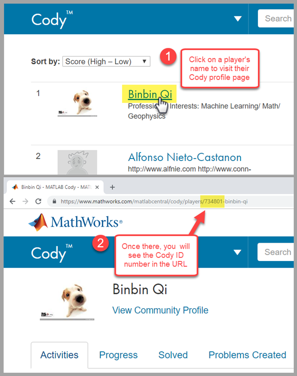
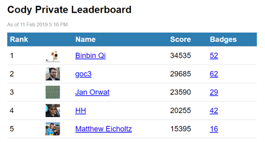

[](https://www.mathworks.com/matlabcentral/fileexchange/70197-private-cody-leaderboard)

[](https://matlab.mathworks.com/open/github/v1?repo=mathworks/Private-Cody-Leaderboards&project=PrivateCodyLeaderboards.prj&file=code/doc/GettingStarted.mlx)

This code is listed on the File Exchange here:
[Private Cody Leaderboard](https://www.mathworks.com/matlabcentral/fileexchange/70197-private-cody-leaderboard)

# Private Cody Leaderboards

This code creates a private leaderboard for Cody players. To use it, you need the Cody IDs of everyone you want to track on the board.

Here is how to find a player's Cody ID.



Once you have everyone's Cody ID, call the code like this.

```
>> filename = 'leaderboard.html';
>> idList = [ ...
    734801    ; ... % Binbin Qi
    3529521   ; ... % Matthew Eicholtz
    5349647   ; ... % goc3
    4345310   ; ... % Jan Orwat
    3397427   ; ... % HH
    ];
>> makeLeaderboard(filename,idList)
```

After you run the code shown above, you should end up with an HTML page that looks something like this.



Run it as often as you like to stay up to date with current situation. Remember, nothing motivates people to play like seeing where they are on the board!

You can learn more about this code by referring to this post on the MATLAB Central Community blog:

[Private Cody Leaderboards](https://blogs.mathworks.com/community/2019/04/08/private-cody-leaderboards/)
